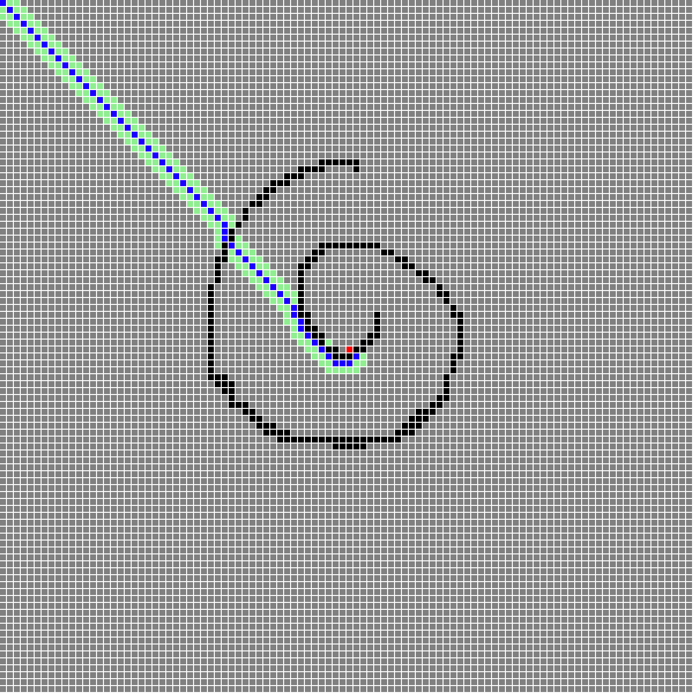

# 第 2 周｜编程与算法训练

## 本周作业

**必做：**

- 每课练习
  1. [实现一个地图编辑器](./homework/pathfinding-algorithm-visualization/1.html)
  2. [广度优先搜索](./homework/pathfinding-algorithm-visualization/2.html)
  3. [通过异步编程将寻路算法可视化](./homework/pathfinding-algorithm-visualization/3.html)
  4. [绘制寻路路径](./homework/pathfinding-algorithm-visualization/4.html)
  5. [启发式搜索（A\*）](./homework/pathfinding-algorithm-visualization/5.html)

**选做**

- 优化现有代码，找最短路径（提示：「碰到墙壁或者走过路」部分的代码要调整）
- 将 Sorted 替换成更好的数据结构（建议：二叉堆）

## 本周总结

本周学习了`寻路算法`和通过`异步编程将寻路算法可视化`

`winter` 老师喜欢在课堂中留一些`“彩蛋”`，照着视频敲出一摸一样的代码，有时候并不能跑通，或者会有问题，这时候就只能自己排查问题，排查的过程中不知不觉对代码和执行流程又熟悉了几遍，收获颇丰。

## 遇到的问题

1. macOS 触控板无法触发鼠标左键和右键的 keydown 事件？

   查阅了 `MDN` 文档，使用触控板时不会触发事件 `keydown` 事件：
   https://developer.mozilla.org/zh-CN/docs/Web/API/KeyboardEvent

   于是改用 pointerdown 指针事件，支持鼠标、触控板、触控屏幕等：
   https://developer.mozilla.org/zh-CN/docs/Web/API/Pointer_events

   ```diff
   -document.addEventListener("keydown", (e) => {
   +document.addEventListener("pointerdown", (e) => {
     keyDown = true;
     clear = e.which === 3;
   });
   -document.addEventListener("keyup", (e) => {
   +document.addEventListener("pointerup", (e) => {
     keyDown = false;
   });
   ```

1. 当逻辑中包含点的对角线移动时，如果围绕某个终点，在地图编辑器中绘制具有弧度，且边宽为一个单元格的「地图」后，执行寻路逻辑绘制的路径会穿越「地图」边界（也就是「地图的墙壁」）

   起点为 `[0,0]`，终点为 `3` 的位置，`1` 的部分表示地图，大概示意图如下（[查看完整地图](./homework/pathfinding-algorithm-visualization/default-map.js)）：

   ```log
   0 0 0 0 0 0 0 0 0 0
   0 0 0 0 0 1 0 0 0 0
   0 0 0 0 1 0 0 0 0 0
   0 0 0 1 0 0 0 0 0 0
   0 0 1 3 1 1 0 0 0 0
   0 0 0 1 1 0 0 0 0 0
   0 0 0 0 0 0 0 0 0 0
   0 0 0 0 0 0 0 0 0 0
   ```

   

   原因在于对角线移动时，没有考虑墙的存在导致的：

   ```js
   // ...
   async function findPath(map, start, end) {
     // ...
     async function insert(x, y, prev) {
       // 走到地图之外
       if (x < 0 || x >= 100 || y < 0 || y >= 100) {
         return;
       }
       // 碰到墙壁或者走过（TODO: 考虑对角线移动，这里需要优化）
       if (table[y * 100 + x]) {
         return;
       }
       //...
     }

     // ...
     await insert(x, y - 1, [x, y]); // 上
     await insert(x, y + 1, [x, y]); // 下
     await insert(x - 1, y, [x, y]); // 左
     await insert(x + 1, y, [x, y]); // 右

     await insert(x - 1, y - 1, [x, y]); // 左上
     await insert(x + 1, y + 1, [x, y]); // 右下
     await insert(x - 1, y + 1, [x, y]); // 左下
     await insert(x + 1, y - 1, [x, y]); // 右上
     // ...
   }
   // ...
   ```

1. Sorted 需要添加 get length() 才能使用 queue.length 访问到 length

   ```diff
   class Sorted {
     // ...
   + get length() {
   +   return this.data.length;
   + }
   }
   ```
